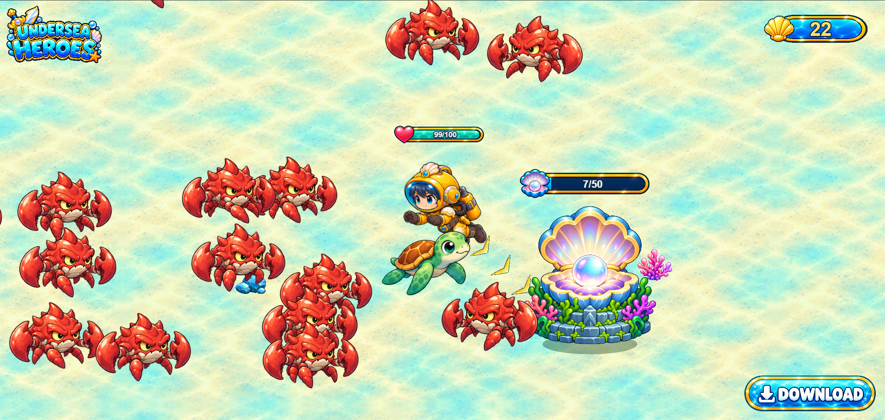

# 海底冒险 · Undersea Adventure

基于 **Cocos Creator 3.8.8** 的 2D 海底冒险游戏，支持浏览器与触屏操作。

**[在线试玩](https://undersea.allan1in.top)**

拖动摇杆移动，自动攻击敌人；收集贝壳、招募海洋伙伴并进化英雄，最终挑战章鱼 Boss。



## 本地运行

1. 使用 Cocos Creator 3.8.8 打开项目。
2. 打开 `assets/scenes/Main.scene`，点击预览。
3. 在画面中按住并拖动，开始游戏。

## HTML 打包

在 PowerShell 中运行：

```powershell
./tools/build-and-pack.ps1
```

输出：`build/undersea-adventure-single.html`，素材与音频内嵌，可直接用浏览器打开。构建需要本机安装 Cocos Creator 3.8.8、Node.js，以及安装 Pillow 的 Python。

代码与素材位于 `assets/`，网页加载模板位于 `build-templates/`。详细工程说明与历史记录见 [AGENTS.md](AGENTS.md)。
